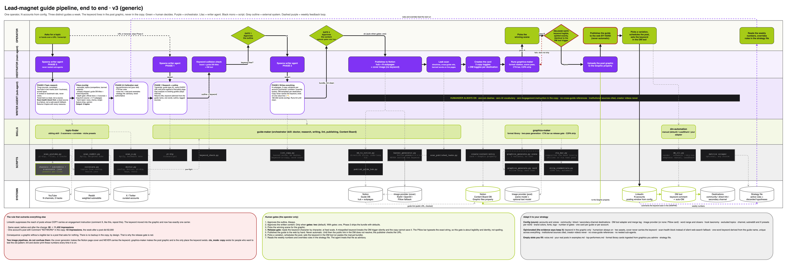

# Guide Maker

A set of Claude Code skills that turn a YouTube video, a transcript, or a trending topic into a published Notion guide, a LinkedIn lead-magnet post with its graphic, and the DMs that deliver the guide to people who comment.

One rule shapes everything: **the keyword lives in the post graphic, never in the copy.** LinkedIn suppresses posts whose text asks for engagement. The same graphic and guide went from 95 to 11,432 impressions when the keyword left the copy; a post that carried `Comment "KEYWORD"` did 43 the week after one did 62,000. The skill writes copy that ends on a value line, puts the keyword in a CTA bar on the image, and lints anything that breaks the rule. Details and the rest of the rationale in [docs/strategy.md](docs/strategy.md).



Editable source: [docs/pipeline.drawio](docs/pipeline.drawio) (open at app.diagrams.net).

## What you get per guide

- A Notion guide: hub page plus 4 to 7 subpages, with a cover image.
- Three LinkedIn post variations (contrarian, problem, quantity hooks), 180 to 250 words, no keyword in the text.
- A post graphic with the keyword CTA bar. Free with Pillow, or generated through an image provider.
- DM templates for every destination you configure: direct link, community, secondary channel.
- A Content Board card with the copy toggles, DM toggles and the graphic on a files property.
- Optional: trending-topic research across YouTube (two tracks), Reddit and X, correlated, with a health gate.

## Install

```bash
git clone https://github.com/josue-commits/guide-maker.git
cd guide-maker && ./install.sh /path/to/your/project
pip install -r requirements.txt
python3 /path/to/your/project/.claude/skills/guide-maker/scripts/doctor.py
```

`install.sh` copies the three skills into `.claude/skills/`, fetches the `topic-finder` sibling, creates `config.yaml` from the example, and runs the doctor. Fill the four required keys (Notion token, Guide Database id, your name, your LinkedIn URL) and you are done. Full walkthrough: [docs/setup.md](docs/setup.md).

Requirements: Python 3.9+, a Notion account, `pyyaml` and `pillow`. Everything else is optional and gated by config: yt-dlp (transcripts and the YouTube scanner), an Apify token (Reddit and X), a KieAI or OpenAI key (AI images), a LeadShark key (scheduling).

## 60-second dry run, no Notion needed

```bash
S=skills/guide-maker/scripts
python3 $S/doctor.py --offline --config tests/fixtures/config.test.yaml
python3 $S/publish_guide_hub.py --dry-run --config tests/fixtures/config.test.yaml \
  --title "Sample Guide" --description "A sample" --keyword SAMPLEKW --type "Technical Tutorial" --week 2026-01-05 --icon "🛠️" \
  --build-item "A working setup" --audience-item "Operators" --nav-note "Skip to step 2 if installed." \
  --step "🚀|Setup|Install and configure|tests/fixtures/sample-guide/01-setup.md" \
  --source "official|Docs|https://example.com/docs"
python3 skills/graphics-maker/scripts/graphics_generate.py card --title "Automate your CRM follow-ups" \
  --subtitle "5 workflows" --stat "3|tools" --keyword SAMPLEKW --output /tmp/post.png --config tests/fixtures/config.test.yaml
python3 $S/lint_copy.py copy tests/fixtures/copy/good-prose-1.txt --keyword SAMPLEKW
```

The whole smoke test: `bash tests/run_smoke.sh`.

## The pipeline

| Step | What happens | Who decides |
|---|---|---|
| 0 | Topic research: three sources scanned, health-checked, correlated, filtered (excluded topics, already shipped, depth gate) | writer agent |
| 0.5 | Calibration read: your top performers, CTA rules, voice | writer agent |
| 1 | Transcript, research, every URL and price verified, gap analysis, outline, keyword | writer agent |
| G1 | Approve the outline | you |
| 2 | Guide, three copy variations, DM templates, lint until clean | writer agent |
| G2 | Approve the content (`workflow.gates: two`, default) | you |
| 3a | Publish hub and subpages to Notion, leak scan | orchestrator |
| 3b | Cover image, no keyword on it, required | orchestrator |
| 3c | Post graphic with the CTA bar, C2PA stripped | graphics-maker |
| 3d | Content Board card, graphic on the `Graphic` property | orchestrator |
| 3e | DM bundle rendered; scheduled if you use an adapter | dm-automation |
| | Publish the Notion page to the web, pick a variation, post | you |

Say `make a guide from this video: <url>`, `find me a topic`, `write the copy for this guide`, or `publish the guide`. Each phase can run alone.

## Skills in this repo

| Skill | Purpose | Needs |
|---|---|---|
| `skills/guide-maker` | The orchestrator: research, writing, publishing, lint, Content Board, doctor | Notion |
| `skills/graphics-maker` | The post graphic: Pillow card or two-pass scene + text, CTA bar, C2PA strip | nothing (Pillow) or an image key |
| `skills/dm-automation` | DM bundle and checklist, or scheduling through an adapter | nothing (manual) or a LeadShark key |
| `topic-finder` (fetched by install.sh, [own repo](https://github.com/josue-commits/topic-finder)) | YouTube, Reddit and X scanners plus correlation and a health report | yt-dlp; Apify for Reddit and X |

## Configuration

One file, `skills/guide-maker/config.yaml`, every key commented in `config.example.yaml`. Secrets can live in env vars or `~/.config/<tool>/api_key` instead. The six keys most people change are in [docs/setup.md](docs/setup.md); everything you can bend is in [docs/customizing.md](docs/customizing.md): your voice and real posts, channel presets, excluded topics, closers, word range, `cta_mode`, multi-account, community and secondary channel, your own graphic formats, adding an image provider or a DM adapter.

## Upgrading from v1

v1 configs still load. `doctor.py --migrate-config` writes the v2 layout. The Content Board needs a `Graphic` files property. See [MIGRATION.md](MIGRATION.md) and [CHANGELOG.md](CHANGELOG.md).

## Repository layout

```
install.sh                 copy skills into a project, fetch topic-finder, run doctor
skills/guide-maker/        SKILL.md, AGENT.md, config.example.yaml, scripts/, references/, templates/, assets/fonts/
skills/graphics-maker/     SKILL.md, scripts/ (providers/, cta_bar.py, strip_credentials.py), references/format-library/
skills/dm-automation/      SKILL.md, scripts/ (dm_cli.py, adapters/), references/
docs/                      setup, customizing, strategy, notion-databases, troubleshooting, pipeline diagram
tests/                     smoke test and fixtures (no tokens, no network)
```

## Background

Built by [Josue Hernandez](https://www.linkedin.com/in/josue-hernandez04) to run a three-guides-a-week LinkedIn lead-magnet operation, then rewritten for anyone to adapt. The [original walkthrough video](https://youtu.be/Z1zx4SivZ2Y) shows v1: the pipeline is the same shape, but the CTA it demonstrates (keyword in the copy) is the one v2 removes. Read [docs/strategy.md](docs/strategy.md) for what changed and why.

## License

MIT. Fonts under `skills/guide-maker/assets/fonts/` are Inter, SIL Open Font License.
